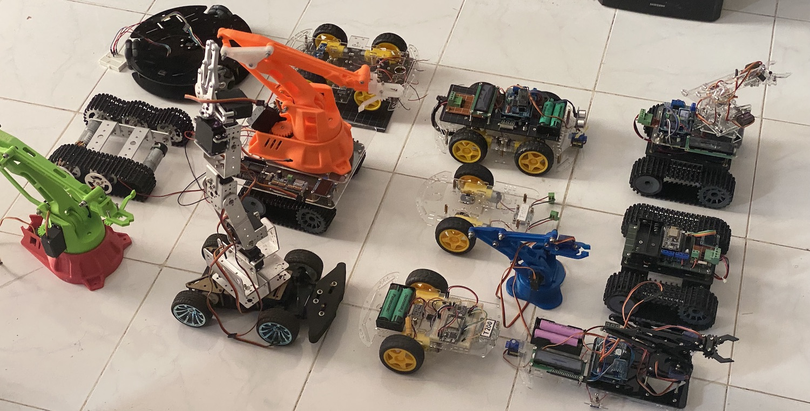

# My robotics projects and journey

My current project is to get the Raspberri Pi 1, 3 and 4 working. And the Jetson Nano I purcheased in 2020 - its time to use it finally in 2024!

By now I have a small collection of robots that wait for attention:

Some are 3 years old, and still fully charged and functioning!

## 2024 Reactivation

I started to update some names of my BT-HD05 modules over a serial port again to connect to my smartphone. The old apps disappeared from the Appstore, but I found some replacements.

## 2019 Limits of the Arduino Uno

- 2019-12-17 [T300](https://kreier.github.io/T300) this robot with 4 wheels, robot arm, ultrasonic distance sensor is the enhanced asa robot. Winner of the first AISVN robot competition [ROBOT 2019](https://sites.google.com/ais.edu.vn/robot2019).
- 2019-11-04 [asa](https://github.com/kreier/asa) robot from first ASA period 2019/2020, evolved to T300 in the second period. After 9 sessions 60% of the students successfully finished their remote controlled robot.
- 2019-04-08 [T200](https://github.com/kreier/T200) updated 2-wheel robot, controlled by an ESP32 over BLE and the software  reverse engineered for our purpose.
- 2019-03-26 [T80](https://github.com/kreier/T80) simplified version for Viet for the [Sciencefair 2019](https://sites.google.com/ais.edu.vn/sciencefair2019/grade-9) Design project. Has a L298N motor driver and HC-05 bluetooth module. Power supply was upgraded to LiIon because the 4 AA batteries provided not enough voltage for the bluetooth module once the motors where started. 
- 2018-10-25 [T110](https://github.com/kreier/T110) updated robot with Bluetooth 4.0 remote to be used by iOS devices.

## 2018 First robot

- 2018-10-09 [T100](https://github.com/kreier/T100) first robot with Bluetooth remote control, 2 wheels, L293D motorshield.

## 2017 Arduino progamming club

The members that signed up sparked the interest to go beyond just blinking LEDs and some sensors and to controlling robots

## 2015 Arduino in vacuum

This was not yet robotics, but my first steps with an Arduino

## 2014 Start with embedded systems

Prior to my first steps in Arduino I tried to create a temperature mearusing station. The ESP line was not out yet, so the cheapest way was to use a Wifi-router, install OpenWRT on it and with this now functioning linux system install missing packages and drivers to collect data from the onewire DS015 temperature sensor and upload the data to the cloud.
